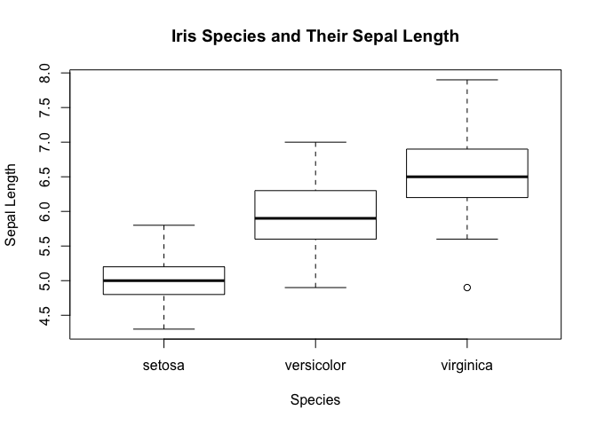

Showing off some ggplot2 skills
================
Yingfei Mu & Wenjing Bao
</br>13 April 2020

## Goal and requirements

The goal of this assignment is simple: I want you to produce *four*
different figures using **ggplot2**. They don’t have to be identify
causal relationships, or anything like that. I just want you to stretch
your visualization legs and demonstrate any new (or existing)
**ggplot2** skills that you have acquired since our first lecture.

Some additional points:

  - You are free to use any dataset that comes in-built with base R, or
    bundled together with an external R package. See
    [here](https://vincentarelbundock.github.io/Rdatasets/datasets.html)
    for an impressive list.

  - That being said, I would especially encourage you to use your own
    data.
    
      - I know we haven’t gotten to data importation yet, but take a
        look
        [here](https://support.rstudio.com/hc/en-us/articles/218611977-Importing-Data-with-RStudio)
        if you need help. I would recommend that you install the
        **readr**, **read\_excel** and **haven** packages first, though.
      - If your dataset isn’t proprietary (or isn’t being read directly
        off the web), please save it in the (empty) `data/` folder of
        this repo.

  - You can use the same dataset for all four of your plots. Or you can
    use a new dataset for each plot. Regardless of what you choose, I
    want you to try and use different geoms for each figure.

  - Any other **ggplot2** skills and add-ons like faceting, changing
    aesthetic scales or legends, using different themes (e.g. from the
    **ggthemes** package), animation, etc. are all welcome and
    encouraged.

  - I want to *see* the code that produces the figures. (Don’t use
    `echo=FALSE` in any of the code chunks, if that means anything to
    you.)

### What you will be graded on

  - Are your figures clear? (e.g. lack of chart chunk, non-overlapping
    labels)
  - Are your figures compelling? (e.g. use an appropriate geom for the
    insight that you want to convey)
  - Variation (I don’t want to see four line charts of the same dataset…
    Be creative)
  - Did you read and follow my instructions (e.g. describe your data and
    figures, show the code that produced the figures, include data in
    the `/data` folder, etc)
  - etc.

Lastly, don’t forget to knit the assignment (click the “Knit” button, or
press `Ctrl+Shift+K`) before submitting\!

## Start the assignment

Here is a R code chunk for you to load your packages. Feel free to load
as many other packages and insert as many additional code chunks
(`Ctr+Alt+I`) as you need. You can always load additional packages in
the their own chunk blocks, but I recommend loading all of your packages
together at the top.)

``` r
if (!require("pacman")) install.packages("pacman")
```

    ## Loading required package: pacman

``` r
## Note: The `p_load()` function from the pacman package is a convenient way to 
## install (if necessary) and load packages all at once. You can think of this
## as an alternative to the normal `library(ggplot2); library(here);...` way of
## loading R packages.
pacman::p_load(ggplot2, here)
```

### Figure 1: Iris Species and Their Sepal Length

Load/read in the data. (Delete this chunk if you don’t need it.)

``` r
# library(readr)
# cool_data <- read_csv(here("data/my-cool-data.csv"))
data(iris)
str(iris)
```

    ## 'data.frame':    150 obs. of  5 variables:
    ##  $ Sepal.Length: num  5.1 4.9 4.7 4.6 5 5.4 4.6 5 4.4 4.9 ...
    ##  $ Sepal.Width : num  3.5 3 3.2 3.1 3.6 3.9 3.4 3.4 2.9 3.1 ...
    ##  $ Petal.Length: num  1.4 1.4 1.3 1.5 1.4 1.7 1.4 1.5 1.4 1.5 ...
    ##  $ Petal.Width : num  0.2 0.2 0.2 0.2 0.2 0.4 0.3 0.2 0.2 0.1 ...
    ##  $ Species     : Factor w/ 3 levels "setosa","versicolor",..: 1 1 1 1 1 1 1 1 1 1 ...

``` r
summary(iris)
```

    ##   Sepal.Length    Sepal.Width     Petal.Length    Petal.Width   
    ##  Min.   :4.300   Min.   :2.000   Min.   :1.000   Min.   :0.100  
    ##  1st Qu.:5.100   1st Qu.:2.800   1st Qu.:1.600   1st Qu.:0.300  
    ##  Median :5.800   Median :3.000   Median :4.350   Median :1.300  
    ##  Mean   :5.843   Mean   :3.057   Mean   :3.758   Mean   :1.199  
    ##  3rd Qu.:6.400   3rd Qu.:3.300   3rd Qu.:5.100   3rd Qu.:1.800  
    ##  Max.   :7.900   Max.   :4.400   Max.   :6.900   Max.   :2.500  
    ##        Species  
    ##  setosa    :50  
    ##  versicolor:50  
    ##  virginica :50  
    ##                 
    ##                 
    ## 

Briefly describe the data here. Then produce the figure. There are five
variables in this dataset, including species, petal width and length as
well as sepal length and width. The Figure 1 tries to compare sepal
length between different iris species. We also mapped species based on
their sepal length and width to give a better visualization on where
each species is.

``` r
# Plot code here
plot(iris$Species, iris$Sepal.Length, xlab="Species", ylab="Sepal Length", main="Iris Species and Their Sepal Length")
```

<!-- -->

``` r
ggplot(data=iris, aes(x=Sepal.Width, y=Sepal.Length, col=Species))+geom_point()
```

<!-- --> From Figure 1, we can
see virginica has the largest median sepal length while setosa has the
smallest median sepal length, and there is an outlier in the virginica
data.

Finally, tell me what I am looking at. Point out anything that you think
is of interest. Now do the same for Figs. 2-4 below…

### Figure 2: Sepal Length vs. Petal Length

For Figure 2, we try to find out the relationship between iris sepal
length and petal length. From the regression line, we can see there is a
positive correlation between iris petal length and sepal length.

``` r
# Plot code here
plot(iris$Sepal.Length ~ iris$Petal.Length,  xlab="Petal Length", ylab="Sepal Length", main="Sepal Length vs. Petal Length", col="pink", pch=16)
abline(lm(iris$Sepal.Length ~ iris$Petal.Length),  col="purple")
```

<!-- -->

### Figure 3: Title description

``` r
# Plot code here
```

### Figure 4: Title description

``` r
# Plot code here
```
